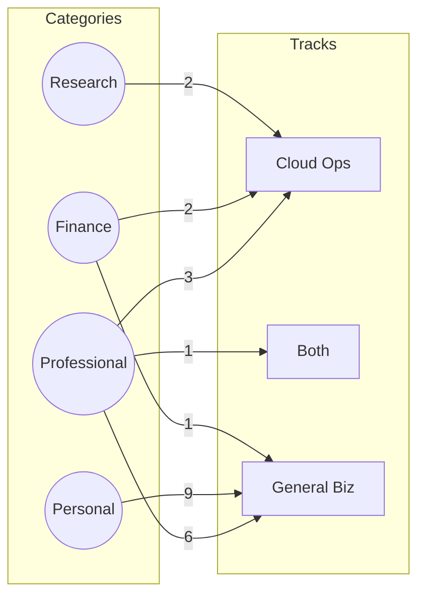

# Claude Use Case Visualization Notes

이 문서는 `docs/reference/claude_use_cases.csv`와 `docs/reference/claude_use_case_tracks.csv`를 기반으로 생성되는 지표를 정리합니다. 원본 집계 데이터는 `docs/reference/claude_use_case_stats.json`에서 확인할 수 있습니다.

## 1. 카테고리 → Track 분포

| Category        | Cloud Ops | Both | General Biz | Total |
|-----------------|-----------|------|-------------|-------|
| Professional    | 3         | 1    | 6           | 10    |
| Legal           | 0         | 0    | 2           | 2     |
| Education       | 0         | 0    | 4           | 4     |
| Personal        | 0         | 0    | 9           | 9     |
| Marketing       | 0         | 0    | 3           | 3     |
| Sales           | 0         | 0    | 3           | 3     |
| Research        | 2         | 0    | 0           | 2     |
| Finance         | 2         | 0    | 1           | 3     |
| HR              | 0         | 0    | 1           | 1     |
| Life Sciences   | 0         | 0    | 2           | 2     |
| **Total**       | **7**     | **1**| **31**      | **39**|

## 2. Track → Persona 상위 분포

| Track       | 대표 Persona (건수) |
|-------------|---------------------|
| Cloud Ops   | FinOps Lead (2), Delivery PM (2), Architecture Researcher (1), Observability Analyst (1), MSP On-call (1) |
| Both        | Automation Architect (1) |
| General Biz | Marketing Ops (2), Brand Studio (2), Corporate Travel (2), Life Sciences PM (2), 기타 23개 persona (각 1) |

## 3. Sankey 예시 (Mermaid)

> 더 많은 카테고리는 페이지 로딩 시간을 고려해 필요한 파트에서만 확장하세요. Mermaid를 지원하지 않는 환경에서는 위 표를 그대로 사용하면 됩니다.

## 4. 활용 가이드
- Part 5/8/9: Cloud Ops 카드 비중(7/39)이 적으므로 각 섹션에서 최소 1개 이상 사례를 인용해 "핵심 업무" 감각을 유지합니다.
- Part 4/6/7: General Biz 카드(31/39)는 페르소나별 활성화 트리거가 잘 정의되어 있으므로, 해당 페르소나를 그대로 문단의 소제목으로 활용합니다.
- 새로운 카드가 추가되면 `stats.json`을 재생성하고 이 문서의 표 값만 갱신하면 됩니다. (Mermaid edge weight도 함께 업데이트)

